# Azure AKS Terraform Platform

Infrastructure Cloud sur Microsoft Azure déployée avec **Terraform**, puis utilisée avec **Kubernetes** et **Helm**.

L'objectif du projet est de construire une plateforme Cloud reproductible, en séparant l'infrastructure Azure, la configuration Kubernetes et le déploiement de l'application.

---

# 1. Objectifs

Ce projet m'a permis de mettre en pratique :

* Infrastructure as Code avec Terraform
* Azure Kubernetes Service (AKS)
* Architecture Terraform modulaire
* Gestion de plusieurs environnements
* Remote Terraform State
* Azure Container Registry (ACR)
* Réseau Azure
* Azure Key Vault
* Azure RBAC
* Azure Workload Identity
* Kubernetes
* Helm
* HPA
* Ingress
* NetworkPolicy
* Readiness/Liveness probes
* Git/GitHub
* Gestion des fichiers sensibles avec `.gitignore`

---

# 2. Architecture

```text
                         PROJET AKS TERRAFORM PLATFORM
                                      │
                 ┌────────────────────┴────────────────────┐
                 │                                         │
             Terraform                                     Helm
          Infrastructure                              Kubernetes Apps
                 │                                         │
                 ▼                                         ▼
            Microsoft Azure                            AKS Cluster
                 │                                         │
        ┌────────┼────────┐                         ┌───────┼────────┐
        │        │        │                         │       │        │
       VNet     ACR   Key Vault                 Deployment Service Ingress
        │                 ▲                         │
        │                 │                         ▼
        └──────► AKS ◄────┘                    Application
                   │
                   │ Workload Identity
                   ▼
             Azure Managed
                Identity
                   │
                   ▼
                Key Vault
```


---

# 3. Structure du projet

```text
azure-aks-terraform-platform/
│
├── terraform/
│   ├── environments/
│   │   ├── dev/
│   │   ├── staging/
│   │   └── production/
│   │
│   └── modules/
│       ├── aks/
│       ├── acr/
│       ├── networking/
│       └── keyvault/
│
├── helm/
│   └── aks-platform/
│       ├── Chart.yaml
│       ├── values.yaml
│       └── templates/
│           ├── deployment.yaml
│           ├── service.yaml
│           ├── ingress.yaml
│           ├── hpa.yaml
│           ├── network-policy.yaml
│           └── serviceaccount.yaml
│
├── docs/
│   └── screenshots/
│
├── .gitignore
└── README.md
```

---

# 4. Prérequis

Avant de commencer, il faut installer :

* Azure CLI
* Terraform
* kubectl
* Helm
* Git

Vérifier les installations :

```powershell
az version
terraform version
kubectl version --client
helm version
git --version
```

Il faut également être connecté à Azure :

```powershell
az login
```

Puis vérifier la souscription utilisée :

```powershell
az account show
```

Si plusieurs souscriptions sont disponibles :

```powershell
az account list -o table
```

Puis sélectionner la bonne :

```powershell
az account set --subscription "<SUBSCRIPTION_ID>"
```

---

# 5. Déployer l'infrastructure Terraform

Le projet est organisé par environnement.

En premier lieu, il faut travailler sur `dev` :

```powershell
cd terraform/environments/dev
```

## Initialiser Terraform

```powershell
terraform init
```

Cette commande initialise :

* le provider AzureRM ;
* le backend Terraform ;
* les modules ;
* les dépendances nécessaires.

---

## Vérifier la configuration

```powershell
terraform validate
```

Résultat attendu :

```text
Success! The configuration is valid.
```

**`screenshots/TerraformValidate.png`**

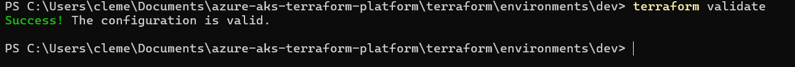

Cette capture montre que la configuration Terraform est valide avant de poursuivre le déploiement.

---

## Prévisualiser les changements

```powershell
terraform plan
```

Cette commande permet de vérifier ce que Terraform va créer, modifier ou supprimer **avant de modifier Azure**.

Lorsque l'infrastructure est déjà complètement déployée, le résultat attendu est :

```text
No changes. Your infrastructure matches the configuration.
```

**`screenshots/TerraformPlan.png`**

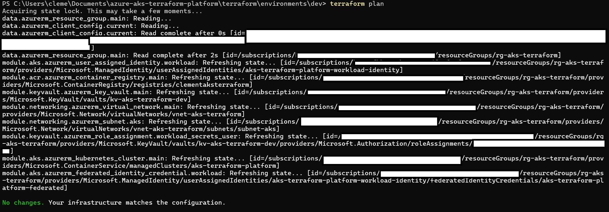

---

## Déployer

Pour créer ou modifier réellement l'infrastructure :

```powershell
terraform apply
```

Puis confirmer avec :

```text
yes
```

## Vérifier les ressources Azure

Le Resource Group permet de regrouper les différentes ressources utilisées par la plateforme.

```powershell
az resource list `
  --resource-group rg-aks-terraform `
  -o table
```

Cette commande permet de vérifier rapidement les ressources Azure créées par Terraform.

**`screenshots/ResourceGroup.png`**


---

# 6. Vérifier les outputs Terraform

Une fois Terraform appliqué :

```powershell
terraform output
```

Pour récupérer une valeur précise :

```powershell
terraform output -raw workload_identity_client_id
```

Cette valeur est notamment utilisée pour configurer l'identité Azure utilisée par Kubernetes.

---

# 7. Récupérer les credentials AKS

Après la création du cluster :

```powershell
az aks get-credentials `
  --resource-group rg-aks-terraform `
  --name aks-terraform-platform `
  --overwrite-existing
```

Vérifier la connexion :

```powershell
kubectl get nodes
```

**`screenshots/Nodes.png`**

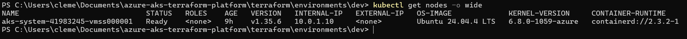

Puis :

```powershell
kubectl get pods -A
```

**`screenshots/Pods.png`**

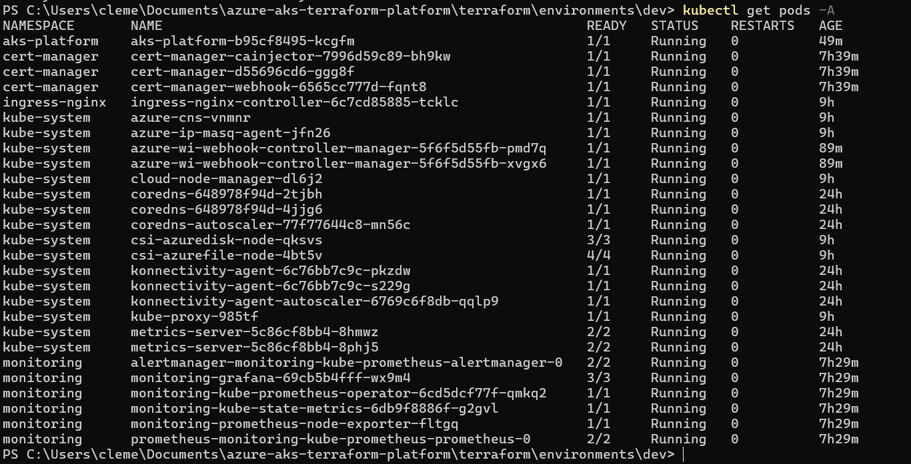

Cette capture permet de montrer les Pods présents dans le cluster Kubernetes après la connexion à AKS.

---

# 8. Vérifier Azure Container Registry

Le projet utilise un ACR pour stocker l'image Docker de l'application.

Vérifier le registre :

```powershell
az acr show `
  --name clementaksterraform `
  --resource-group rg-aks-terraform
```

Lister les repositories :

```powershell
az acr repository list `
  --name clementaksterraform `
  -o table
```

L'image utilisée par Helm est :

```text
clementaksterraform.azurecr.io/aks-platform:latest
```

**`screenshots/ACR.png`**

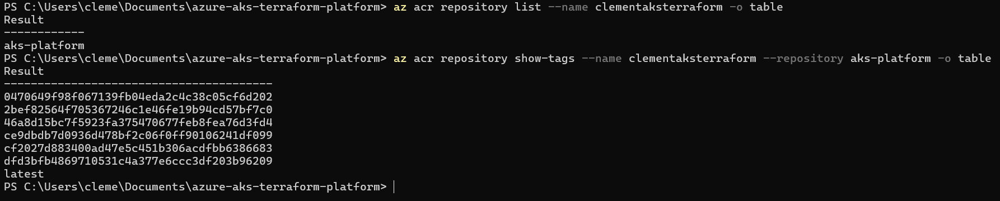

---

# 9. Déployer l'application avec Helm

Se placer dans le chart :

```powershell
cd helm/aks-platform
```

Avant l'installation, vérifier que Helm détecte correctement le chart :

```powershell
helm lint .
```

Puis afficher les manifests générés :

```powershell
helm template aks-platform .
```

Cette commande est très utile pour comprendre comment les fichiers de templates Helm deviennent des manifests Kubernetes.

---

## Installer l'application

Créer le namespace :

```powershell
kubectl create namespace aks-platform
```

Puis installer le chart :

```powershell
helm install aks-platform . `
  --namespace aks-platform
```

Si le release existe déjà, utiliser :

```powershell
helm upgrade aks-platform . `
  --namespace aks-platform
```

Vérifier le release :

```powershell
helm list -n aks-platform
```

**`screenshots/Helm.png`**

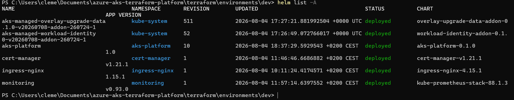

**`screenshots/HelmStatus.png`**

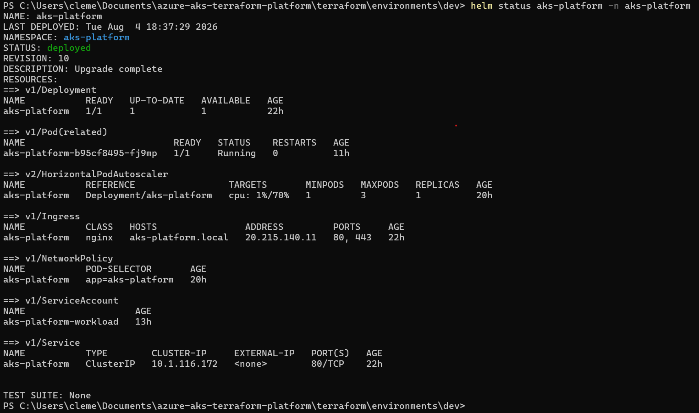

---

# 10. Vérifier Kubernetes

Vérifier le Deployment :

```powershell
kubectl get deployment -n aks-platform
```

**`screenshots/DeploymentGet.png`**

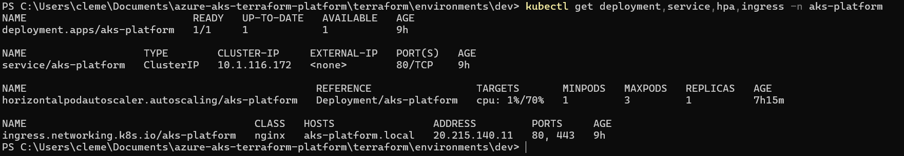

Vérifier les Pods :

```powershell
kubectl get pods -n aks-platform
```

**`screenshots/Pods.png`**


Vérifier le Service :

```powershell
kubectl get service -n aks-platform
```

**`screenshots/Service.png`**

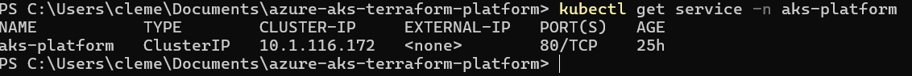

Lister les ressources :

```powershell
kubectl get all -n aks-platform
```

**`screenshots/KubernetesRessources.png`**

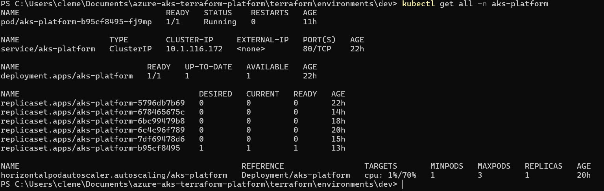

---

# 11. Vérifier le Deployment

Le Deployment utilise l'image :

```text
clementaksterraform.azurecr.io/aks-platform:latest
```

et expose le port `8080`.

Il contient également deux probes :

```yaml
readinessProbe:
  httpGet:
    path: /health
    port: 8080

livenessProbe:
  httpGet:
    path: /health
    port: 8080
```

Vérifier :

```powershell
kubectl describe deployment aks-platform -n aks-platform
```

**`screenshots/Deployment.png`**

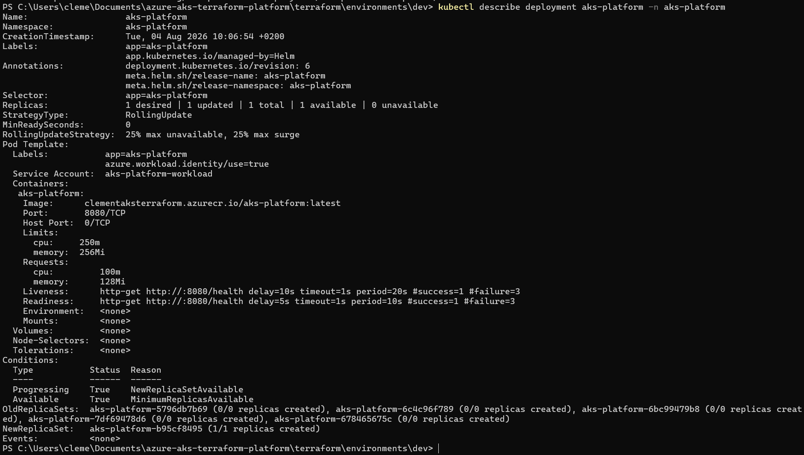

---

# 11.5. Vérifier la NetworkPolicy

Le chart Helm contient également une **NetworkPolicy** permettant de contrôler les communications réseau des Pods.

Vérifier la NetworkPolicy :

```powershell
kubectl get networkpolicy -n aks-platform
```

Pour obtenir plus de détails :

```powershell
kubectl describe networkpolicy aks-platform -n aks-platform
```

Cette vérification permet de confirmer que la politique réseau a bien été créée dans le namespace `aks-platform`.

**`screenshots/NetworkPolicy.png`**

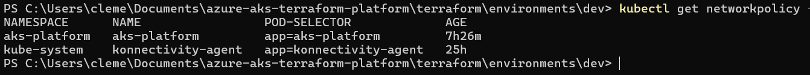

---

# 12. Vérifier et tester le HPA

Le chart Helm contient un **Horizontal Pod Autoscaler (HPA)**.

Il permet à Kubernetes d'augmenter ou de diminuer automatiquement le nombre de Pods en fonction de l'utilisation CPU.

## Vérifier la configuration

```powershell
kubectl get hpa -n aks-platform
```

Puis :

```powershell
kubectl describe hpa aks-platform -n aks-platform
```

La configuration est :

```yaml
autoscaling:
  enabled: true
  minReplicas: 1
  maxReplicas: 3
  targetCPU: 70
```

Cela signifie que :

* le Deployment possède au minimum **1 Pod** ;
* il peut monter jusqu'à **3 Pods** ;
* Kubernetes essaie de maintenir l'utilisation CPU autour de **70 %**.

## Tester le scaling

Pour tester le HPA, on peut générer temporairement de la charge CPU sur l'application.

Dans un premier terminal, observer le HPA :

```powershell
kubectl get hpa -n aks-platform -w
```

Dans un deuxième terminal, observer les Pods :

```powershell
kubectl get pods -n aks-platform -w
```

Dans un troisième terminal, générer de la charge sur le Pod :

```powershell
kubectl run load-generator `
  --rm -it `
  --restart=Never `
  --image=busybox `
  -- /bin/sh
```

Une fois dans le conteneur :

```sh
while true; do wget -q -O- http://aks-platform.aks-platform.svc.cluster.local/health > /dev/null; done
```

La charge générée permet au HPA de détecter une augmentation de l'utilisation CPU.

On peut alors observer l'évolution :

```text
1 replica
   ↓
CPU augmente
   ↓
HPA détecte le dépassement du seuil
   ↓
2 replicas
   ↓
CPU continue d'augmenter
   ↓
3 replicas maximum
```

Pour arrêter le test, utiliser :

```text
Ctrl+C
```

Puis quitter le conteneur :

```sh
exit
```

Le Pod `load-generator` étant lancé avec `--rm`, il est automatiquement supprimé après son arrêt.

## Observer le retour à la normale

Après l'arrêt de la charge, on peut continuer à observer :

```powershell
kubectl get hpa -n aks-platform -w
```

et :

```powershell
kubectl get pods -n aks-platform -w
```

Le nombre de replicas peut progressivement redescendre vers le minimum configuré.

**`12-hpa-status.png`**

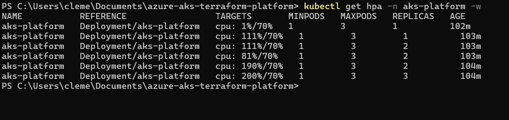

Montrer :

```powershell
kubectl get hpa -n aks-platform
```

avec :

* le nombre minimal de replicas ;
* le nombre maximal ;
* l'objectif CPU ;
* le nombre actuel de replicas.

**`13-hpa-scaling.png`**

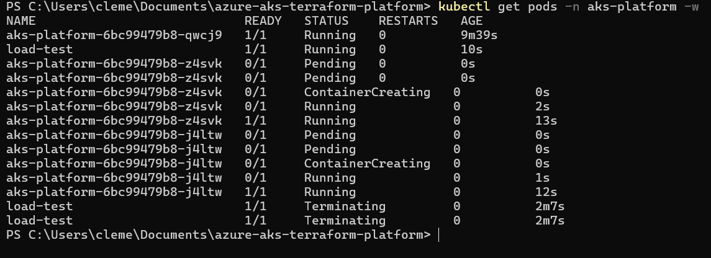

Montrer :

```powershell
kubectl get pods -n aks-platform
```

pendant le scaling, avec plusieurs Pods `Running`.

Cette deuxième capture permet de montrer que le HPA n'est pas seulement configuré : **il a réellement déclenché la création de plusieurs Pods en réponse à la charge.**

---

# 12.5. Dashboard Grafana

Grafana permet de visualiser les métriques de la plateforme Kubernetes sous forme de graphiques.

Le dashboard permet notamment d'observer l'utilisation des ressources du cluster et des applications.

**`grafana-screenshot.png`**

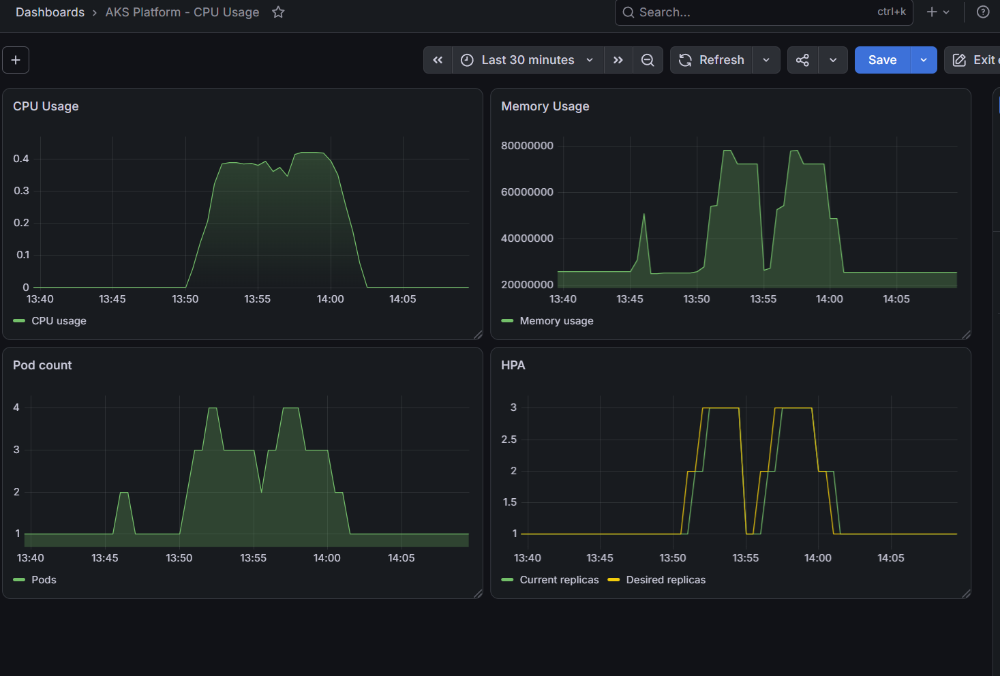

---

# 13. Azure Workload Identity

L'application utilise un ServiceAccount Kubernetes dédié :

```text
aks-platform-workload
```

Vérifier :

```powershell
kubectl get serviceaccount aks-platform-workload `
  -n aks-platform -o yaml
```

La partie importante est :

```yaml
annotations:
  azure.workload.identity/client-id: <CLIENT_ID>
```

**`ServiceAccount.png`**

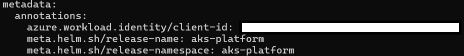

---

## Vérifier que le Deployment utilise le ServiceAccount

```powershell
kubectl get deployment aks-platform `
  -n aks-platform -o yaml
```

**`13-workload-identity-deployment.png`**

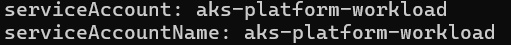

---

## Vérifier l'environnement du Pod

Pour vérifier que l'injection liée à Workload Identity fonctionne :

```powershell
kubectl exec -n aks-platform deploy/aks-platform -- env |
  Select-String "AZURE"
```

Selon la configuration et la version utilisée, les variables Azure injectées peuvent apparaître ici.

**`workload-identity-env.png`**

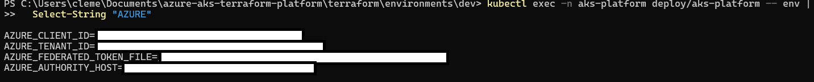

---

# 14. Azure Key Vault

Le projet utilise :

```text
kv-aks-terraform-dev
```

Vérifier l'existence du Key Vault :

```powershell
az keyvault show `
  --name kv-aks-terraform-dev `
  --resource-group rg-aks-terraform
```

Vérifier les role assignments :

```powershell
az role assignment list `
  --scope "/subscriptions/<SUBSCRIPTION_ID>/resourceGroups/rg-aks-terraform/providers/Microsoft.KeyVault/vaults/kv-aks-terraform-dev" `
  --assignee <IDENTITY_OBJECT_ID> `
  -o table
```

**`RBAC-Permissions.png`**

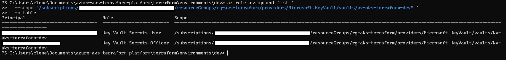

---

# 15. Test Key Vault et problème RBAC rencontré

Pendant le projet, un test de création de secret a initialement échoué :

```powershell
az keyvault secret set `
  --vault-name kv-aks-terraform-dev `
  --name test-secret `
  --value "hello-from-key-vault"
```

Azure a retourné :

```text
ForbiddenByRbac
Caller is not authorized to perform action on resource.
Assignment: (not found)
```

Le problème venait des permissions RBAC.

Après vérification et correction des role assignments, Terraform affichait ensuite :

```text
module.keyvault.azurerm_role_assignment.workload_secrets_user
```

dans le state.

**`keyvault-rbac-error.png`**

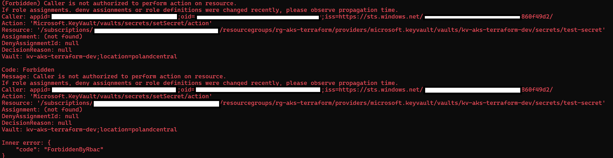

---

# 16. Terraform State

Le projet a été refondu afin de passer d'une infrastructure Terraform directement définie dans l'environnement à une architecture modulaire.

Avant :

**`AvantMigration.png`**

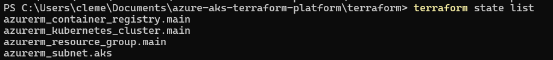

Après :

**`ApresMigration.png`**

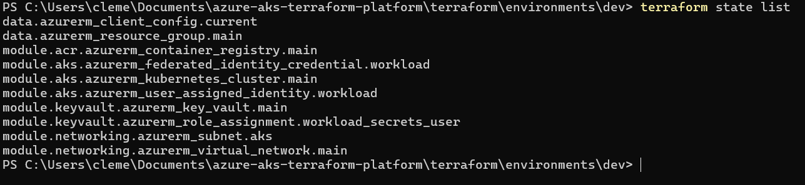

---

# 17. Problème GitHub : fichier Terraform trop volumineux

Lors du premier `git push`, GitHub a refusé le dépôt.

Le problème venait de :

```text
terraform/environments/dev/.terraform/
```

qui contenait le provider AzureRM :

```text
terraform-provider-azurerm_v4.81.0_x5.exe
```

Sa taille était d'environ :

```text
238.60 MB
```

GitHub limite les fichiers classiques à :

```text
100 MB
```

Erreur :

```text
GH001: Large files detected
```

**`github-large-file-error.png`**

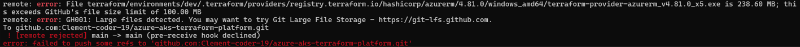

---

# 18. Correction du problème Git

Les fichiers générés par Terraform ne doivent pas être versionnés.

Le `.gitignore` contient notamment :

```gitignore
terraform/.terraform/
terraform/*.tfstate
terraform/*.tfstate.*
terraform/crash.log
terraform/crash.*.log
terraform/*.tfvars
terraform/*.tfvars.json
terraform/terraform-state-backup.json
```

Cela permet d'éviter de pousser :

* les providers Terraform téléchargés ;
* les states locaux ;
* les backups de state ;
* les fichiers contenant potentiellement des valeurs sensibles ;
* les fichiers générés automatiquement.

Après correction :

```powershell
git status
```

puis :

```powershell
git add .
git commit -m "Configure Terraform modules and Helm platform"
git push
```

**`gitignore.png`**

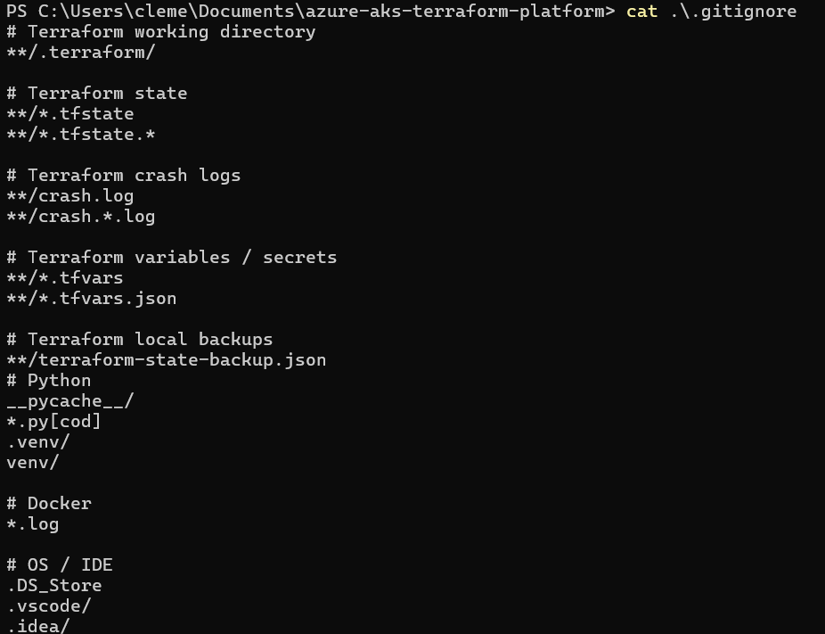

---

# 19. Validation finale

Une fois toutes les ressources configurées :

```powershell
cd terraform/environments/dev
terraform plan
```

Résultat attendu :

```text
No changes. Your infrastructure matches the configuration.
```

Puis vérifier Kubernetes :

```powershell
kubectl get pods -n aks-platform
```

et :

```powershell
kubectl get all -n aks-platform
```

**`20-final-validation.png`**

Cette capture peut idéalement montrer :

```text
terraform plan
No changes.
```

et une seconde capture :

```text
kubectl get pods -n aks-platform
```

avec le Pod en `Running`.

---

# 20. Arrêter l'environnement pour économiser

Le cluster AKS peut représenter une partie importante du coût du projet.

Lorsque je ne travaille pas dessus, je peux arrêter le cluster :

```powershell
az aks stop `
  --name aks-terraform-platform `
  --resource-group rg-aks-terraform
```

Vérifier son état :

```powershell
az aks show `
  --name aks-terraform-platform `
  --resource-group rg-aks-terraform `
  --query powerState
```

Pour reprendre le travail :

```powershell
az aks start `
  --name aks-terraform-platform `
  --resource-group rg-aks-terraform
```

Puis récupérer à nouveau les credentials si nécessaire :

```powershell
az aks get-credentials `
  --resource-group rg-aks-terraform `
  --name aks-terraform-platform `
  --overwrite-existing
```

---

# 21. Reproduire le projet depuis zéro

Voici le workflow principal utilisé pour travailler sur le projet.

## Étape 1 — Connexion Azure

```powershell
az login
```

```powershell
az account show
```

---

## Étape 2 — Terraform

```powershell
cd terraform/environments/dev
```

```powershell
terraform init
```

```powershell
terraform validate
```

```powershell
terraform plan
```

Si le plan est correct :

```powershell
terraform apply
```

---

## Étape 3 — Connexion à AKS

```powershell
az aks get-credentials `
  --resource-group rg-aks-terraform `
  --name aks-terraform-platform `
  --overwrite-existing
```

```powershell
kubectl get nodes
```

---

## Étape 4 — Déploiement Helm

```powershell
cd ..\..\..\helm\aks-platform
```

Vérifier le chart :

```powershell
helm lint .
```

Puis :

```powershell
helm upgrade --install aks-platform . `
  --namespace aks-platform `
  --create-namespace
```

---

## Étape 5 — Vérifier l'application

```powershell
kubectl get pods -n aks-platform
```

```powershell
kubectl get service -n aks-platform
```

```powershell
kubectl get ingress -n aks-platform
```

```powershell
kubectl get hpa -n aks-platform
```

Pour regarder les logs :

```powershell
kubectl logs -n aks-platform deploy/aks-platform
```

Pour vérifier le Deployment :

```powershell
kubectl describe deployment aks-platform -n aks-platform
```

# 22. Problèmes rencontrés

Ce projet m'a permis de rencontrer plusieurs problèmes réels lors de la mise en place de l'infrastructure et du déploiement. Ces problèmes m'ont surtout permis de comprendre les dépendances entre Terraform, Azure, Kubernetes et Helm.

### Terraform

* **Module Terraform non initialisé** : certains modules n'étaient pas encore correctement initialisés après la réorganisation du projet. J'ai dû réinitialiser Terraform avec `terraform init` afin de télécharger les dépendances et de prendre en compte la nouvelle architecture.

* **Incompatibilité avec la version du provider AzureRM** : certains arguments utilisés dans les ressources Terraform n'étaient plus compatibles avec la version du provider utilisée. Cela m'a obligé à vérifier la documentation du provider et à adapter la configuration.

* **Variable `tags` manquante** : une variable utilisée par les modules n'était pas correctement déclarée ou transmise. J'ai dû suivre le cheminement des variables entre l'environnement et les modules afin de corriger la configuration.

* **Migration vers une architecture modulaire** : l'infrastructure était initialement définie directement dans l'environnement Terraform. J'ai ensuite séparé les ressources en plusieurs modules (`aks`, `acr`, `networking` et `keyvault`). Cette modification nécessitait de faire attention au Terraform State afin que Terraform reconnaisse les ressources existantes sans essayer de les recréer.

* **Synchronisation du State avec Azure** : après plusieurs modifications, j'ai utilisé `terraform plan` pour vérifier que l'état décrit par Terraform correspondait bien à l'infrastructure réellement présente sur Azure. Le résultat final était :

  ```text
  No changes. Your infrastructure matches the configuration.
  ```

### Azure

* **Permissions RBAC insuffisantes sur Key Vault** : lors d'un test de création d'un secret avec Azure CLI, Azure a retourné une erreur `ForbiddenByRbac`. Le compte utilisé n'avait pas les permissions nécessaires pour effectuer l'action `setSecret`.

* **Propagation des role assignments** : après avoir ajouté ou modifié une permission RBAC, les changements ne sont pas toujours immédiatement visibles. J'ai dû vérifier les role assignments et prendre en compte le délai de propagation des permissions Azure.

* **Configuration de Workload Identity** : la connexion entre Kubernetes et Azure nécessite plusieurs éléments qui doivent correspondre : le ServiceAccount Kubernetes, la Managed Identity, le `client-id` et le Federated Identity Credential. Une erreur dans l'un de ces éléments peut empêcher l'identité d'être correctement utilisée par le Pod.

* **Managed Identity et Federated Identity Credential** : j'ai dû comprendre le rôle de la Managed Identity et du Federated Identity Credential pour permettre à un workload Kubernetes de s'authentifier auprès des services Azure sans stocker de secret directement dans le Pod.

### Kubernetes / Helm

* **Configuration du ServiceAccount** : l'application utilise un ServiceAccount Kubernetes dédié afin de pouvoir utiliser Azure Workload Identity. J'ai vérifié que le ServiceAccount était bien créé et associé au Deployment.

* **Association du ServiceAccount au Deployment** : il ne suffisait pas de créer le ServiceAccount. Le Deployment devait également utiliser `aks-platform-workload` grâce à `serviceAccountName`.

* **Configuration des probes** : le Deployment utilise une `readinessProbe` et une `livenessProbe` sur `/health`. Cela m'a permis de comprendre la différence entre vérifier si une application est prête à recevoir du trafic et vérifier si elle fonctionne toujours correctement.

* **Configuration du HPA** : le Horizontal Pod Autoscaler devait être configuré avec un nombre minimum et maximum de replicas ainsi qu'un objectif CPU. J'ai également réalisé un test de charge pour vérifier que le nombre de Pods pouvait réellement augmenter.

* **Déploiement et mise à jour avec Helm** : j'ai utilisé `helm install` puis `helm upgrade` pour déployer et mettre à jour l'application. Cela m'a permis de comprendre la notion de release Helm et la manière dont les templates deviennent des manifests Kubernetes.

* **NetworkPolicy et ressources Kubernetes** : j'ai également vérifié que les différentes ressources créées par Helm étaient bien présentes dans le namespace `aks-platform`, notamment le Deployment, le Service, le HPA, l'Ingress, le ServiceAccount et la NetworkPolicy.

### Git / GitHub

* **Provider Terraform de plus de 100 MB** : lors du premier `git push`, GitHub a refusé le dépôt car le provider AzureRM téléchargé dans `.terraform/` faisait environ `238.60 MB`, alors que GitHub impose une limite de `100 MB` pour les fichiers classiques.

* **Correction avec `.gitignore`** : j'ai identifié que les fichiers du dossier `.terraform/` n'avaient pas vocation à être versionnés. J'ai donc ajouté les fichiers générés par Terraform au `.gitignore`.

* **Exclusion des states et fichiers potentiellement sensibles** : les fichiers `.tfstate`, `.tfvars` et autres fichiers générés ont également été exclus du dépôt afin d'éviter de publier des informations qui n'ont pas leur place dans Git.

Ces problèmes m'ont permis de comprendre que la mise en place d'une infrastructure Cloud ne consiste pas uniquement à exécuter des commandes. Il faut comprendre les relations entre les différents composants, savoir lire les erreurs et identifier à quel niveau se situe le problème.

J'ai notamment appris à distinguer les problèmes liés à **Terraform et son State**, ceux liés aux **permissions Azure**, ceux liés à la **configuration Kubernetes/Helm**, et ceux liés à la **gestion du code avec Git**. C'est également ce qui m'a permis de construire une plateforme plus reproductible et plus facile à maintenir.

---

# 23. Ce que j'ai appris

Le projet m'a permis de mieux comprendre le lien entre :

```text
Terraform
   │
   ▼
Infrastructure Azure
   │
   ├── Networking
   ├── AKS
   ├── ACR
   ├── Key Vault
   └── Managed Identity
          │
          ▼
      Kubernetes
          │
          └── Helm
```

J'ai notamment appris à :

* décrire une infrastructure avec Terraform ;
* organiser Terraform avec des modules ;
* gérer un state distant ;
* déployer et administrer AKS ;
* utiliser ACR avec Kubernetes ;
* déployer une application avec Helm ;
* utiliser Kubernetes ServiceAccounts ;
* connecter Kubernetes à Azure grâce à Workload Identity ;
* gérer les permissions avec Azure RBAC ;
* diagnostiquer des erreurs Terraform, Azure et Kubernetes ;
* éviter de versionner des fichiers sensibles ou générés ;
* prendre en compte les coûts d'une infrastructure Cloud.

---

# 24. Technologies utilisées

* Microsoft Azure
* Azure Kubernetes Service (AKS)
* Azure Container Registry (ACR)
* Azure Key Vault
* Azure RBAC
* Azure Workload Identity
* Azure Virtual Network
* Terraform
* Kubernetes
* Helm
* PowerShell
* Git
* GitHub

---

# 25. Captures d'écran du projet

Les captures sont stockées dans :

```text
docs/screenshots/
```
# 26. License

Ce projet est distribué sous licence MIT.

Voir le fichier LICENSE pour le texte complet de la licence.

